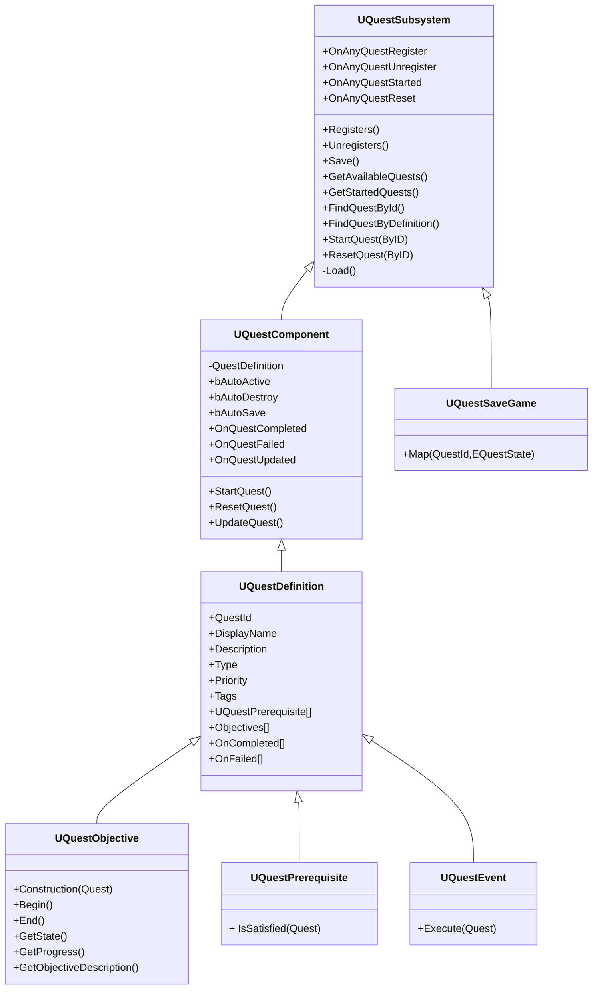

# QuestCore

<p align="center">
  
</p>

<p align="center">
  <b>A lightweight Unreal Engine C++ plugin for fast quest-system prototyping</b><br/>
  Composable set of building blocks: quests are data assets driven by an <code>ActorComponent</code>, objectives/prerequisites/events are all Command Pattern objects, and everything advances through explicit <code>UpdateQuest()</code> calls instead of ticking.
</p>

<p align="center">
  
  
  
  
</p>

---

> **⚠️ Important — Beta plugin, instance lifetime caveat**
> QuestCore is in **beta**. One thing to know before you rely on it for testing: `UQuestObjective`, `UQuestPrerequisite`, and `UQuestEvent` are all `DefaultToInstanced`, which means each one instanced on a `UQuestDefinition` is a sub-object of that data asset, not something that gets destroyed when you stop Play In Editor.
>
> In practice this means **any runtime state you cache on an objective/prerequisite/event instance (outside `UPROPERTY` fields meant to persist) survives across PIE sessions** — the instance keeps living as long as the `UQuestDefinition` asset stays loaded in memory, which for editor testing is typically until you close and reopen the editor (or the asset otherwise gets unloaded). It is **not** reset just because you pressed Stop.
>
> If your custom objective/prerequisite/event caches anything at runtime (a timer handle, a counter, a cached pointer, etc.), reset it explicitly in `Begin()` (or wherever your class's "start" hook is) rather than assuming it starts fresh — don't rely on a constructor or on PIE exit to clear it for you.

## Why QuestCore

- **No tick, anywhere.** Objectives resolve by polling (checked when `UpdateQuest()` runs) or by binding to gameplay events — never a per-frame `Tick()`.
- **Command Pattern all the way down.** Objectives, prerequisites, and events are each small, self-contained objects with a fixed interface (`Begin`/`End`/`GetState`/`GetProgress` for objectives, `IsSatisfied` for prerequisites, `Execute` for events), so new ones are cheap to add and the rest of the system never needs to know how they resolve internally.
- **Quests are data assets.** A `UQuestDefinition` (`DataAsset`) owns the quest's identity, its objectives, its prerequisites, and its on-completed/on-failed event lists — all editable and browsable in the Content Browser, not hand-typed strings scattered across actors.
- **Built-in save/load**, project-wide config via **Project Settings → Plugins → Quest Core**, and a full Blueprint-exposed API on both the component and the subsystem.

## Installation

1. Copy the `QuestCore` folder into your project's `Plugins/` directory.
2. Enable **QuestCore** in Edit → Plugins.
3. Regenerate project files and build.

## Quick Start

1. **Create a Quest Definition asset** — right-click in the Content Browser → **Create → Quest → Quest Definition**. It gets a `QuestId` automatically from the asset name.
2. **Fill it in**: add one or more `Objectives`, optionally some `Prerequisites` that must be satisfied before the quest can start, and optionally `OnCompleted`/`OnFailed` events (e.g. to auto-start the next quest in a chain).
3. **Add a `QuestComponent`** to an actor (an NPC, a manager actor, whatever owns the quest) and assign the Quest Definition to it.
4. **Drive it from gameplay code:**

```cpp
UQuestSubsystem *Subsystem = GetWorld()->GetSubsystem<UQuestSubsystem>();

// Start a quest by its definition asset
Subsystem->StartQuest(MyQuestDefinition);

// ...or by id
Subsystem->StartQuestById(TEXT("MyFirstQuest"));

// Re-evaluate whenever something relevant happens
QuestComponent->UpdateQuest();

// Check progress/status
const float Progress = QuestComponent->GetProgress();
const bool bDone = Subsystem->IsQuestCompletedById(TEXT("MyFirstQuest"));
```

Event-driven objectives resolve on their own once the right condition fires and call the protected `UpdateQuest()` helper internally — no manual polling loop needed for those. Polling-style objectives (like `Reach Location`) are simply re-checked live whenever `UpdateQuest()` runs.

## Architecture

```
UQuestDefinition : UDataAsset
 ├── QuestId, DisplayName, Description, Type, Priority, Tags   - designer-facing identity
 ├── Prerequisites[]           - UQuestPrerequisite objects gating StartQuest()
 ├── Objectives[]               - the objectives that make up the quest
 ├── OnCompleted[] / OnFailed[] - UQuestEvent objects fired on resolution
 └── (auto-fills QuestId from the asset name on creation)

UQuestObjective (abstract, Command Pattern)
 ├── Construction(Quest)        - wires the objective to its owning QuestComponent/World
 ├── Begin()                    - called once the objective becomes active
 ├── End()                      - cleanup, always called (success, fail, or reset)
 ├── GetState() -> EQuestObjectiveState   (InProgress / Done / Failed / Canceld)
 ├── GetProgress() -> float     (0-1, optional, for UI)
 └── GetObjectiveDescription() -> FString

UQuestPrerequisite (abstract, Command Pattern)
 └── IsSatisfied(Quest) -> bool

UQuestEvent (abstract, Command Pattern)
 └── Execute(Quest)             - side effect fired from OnCompleted/OnFailed

UQuestComponent : UActorComponent
 ├── QuestDefinition            - the data asset this component drives
 ├── bAutoActive / bAutoDestroy / bAutoSave
 ├── StartQuest() / ResetQuest() / UpdateQuest()
 └── OnQuestCompleted / OnQuestFailed / OnQuestUpdated delegates

UQuestSubsystem : UWorldSubsystem
 ├── Registers/unregisters quests as they BeginPlay/EndPlay
 ├── GetAvailableQuests() / GetStartedQuests()
 ├── FindQuestById() / FindQuestByDefinition()
 ├── StartQuest(ById) / ResetQuest(ById)
 ├── Save/Load via UQuestSaveGame (QuestId -> EQuestState map)
 └── OnAnyQuestRegister / OnAnyQuestUnregister / OnAnyQuestStarted / OnAnyQuestReset
```

A quest completes once **every** objective in its definition's `Objectives` array reports `Done`; if any reports `Failed`, the quest fails immediately. Objectives don't need to be authored one-at-a-time — `Composite`, `DefinitionOfDone`, `Check`, and `If` (below) let a single "objective slot" represent AND/OR/threshold/branching logic over other objectives.

## Runtime Flow

**1. Startup (per world)**
`UQuestSubsystem::Initialize()` runs first, before any quest exists yet. It calls `LoadQuestData()`, which reads the configured save slot (if one exists) into `PendingLoadedStates` — a `QuestId -> EQuestState` map staged in memory, not applied to anything yet, since no `QuestComponent` has registered at this point.

**2. A quest comes online**
When a `QuestComponent`'s owning actor spawns, `BeginPlay()`:
- Calls `Construction(this)` on every objective in the definition's `Objectives` array — this wires up each objective's back-reference to its owning `QuestComponent` and `World`. It does **not** start the objective; that's `Begin()`'s job, later.
- Registers with the subsystem via `RegisterQuest()`, which rejects the quest (and screen-logs in red) if another registered quest already shares its `QuestId`.
- If registration succeeds and a saved state exists for this `QuestId`, `ApplyLoadedState()` restores it immediately — `Completed`/`Failed` just set the internal state directly (nothing to resume, with `bAutoDestroy` honored), `InProgress` re-enters through `SetState(InProgress)`, which re-`Begin()`s every objective so event-driven ones can rebind.
- Only then, if nothing was loaded and `bAutoActive` is set, does it call `StartQuest()` itself.

**3. Starting**
`StartQuest()` bails out if the quest is already `InProgress`, then checks `ArePrerequisitesSatisfied()` — every `UQuestPrerequisite` in the definition's `Prerequisites` list must return `true` (an empty list is *not* automatically satisfied for the built-in dependency prerequisites — see below). If it passes, `SetState(InProgress)` runs, which calls `Begin()` on every objective (this is the point objectives actually start polling/binding) and notifies the subsystem.

**4. Resolving**
Something calls `UpdateQuest()` — an objective calling its own protected `UpdateQuest()` helper after resolving itself, or external gameplay code. `UpdateQuest()` reads every objective's `GetState()`: any `Failed` short-circuits to `SetState(Failed)`; all `Done` triggers `SetState(Completed)`; otherwise it just broadcasts `OnQuestUpdated` and waits.

**5. Resolution**
`SetState(Completed)` / `SetState(Failed)` both: call `End()` on every objective (cleanup — unbind events, clear timers), broadcast the component-level `OnQuestCompleted`/`OnQuestFailed`, run every `UQuestEvent` in the definition's matching `OnCompleted`/`OnFailed` list (e.g. auto-starting or resetting other quests), save via `SaveQuestData()` if `bAutoSave` is set, notify the subsystem, and destroy the owning actor if `bAutoDestroy` is set.

**6. Teardown**
`EndPlay()` calls `ResetQuest()` if the quest was still `InProgress` (which runs `SetState(NotStarted)` → `End()`s every objective) and then `UnregisterQuest()`.

**7. Editor-time visualization (separate from the runtime flow above)**
`QuestComponent` exposes a `CallInEditor` **Visualize** button that calls `OnVisualize()` on every prerequisite, objective, and event in the assigned definition — used for debug drawing (e.g. `ActorInBox` draws its check volume) without needing to Play In Editor.

## Built-in Objectives

| Class | Resolves by | Notes |
|---|---|---|
| `Reach Location` | Polling | Distance check between a player pawn (by `PlayerIndex`) and the quest's owning actor, within `AcceptRadius` |
| `Wait` | `TimerManager` (single-shot) | Completes after `Duration` seconds since `Begin()`; `Result` lets it resolve to `Done` or `Failed` |
| `Auto Update` | Looping timer | Utility objective, not a gameplay condition — periodically finds its own quest via the subsystem and calls `UpdateQuest()`. Always reports `Done` so it never blocks completion; it just keeps the quest re-evaluating without a Tick |
| `Composite` | Aggregates children | `RequireAll` (AND) or `RequireAny` (OR) over a list of `ChildObjectives` |
| `Definition Of Done` | Aggregates children (threshold) | `Done` once `RequiredDoneCount` children are `Done`; `Failed` once `RequiredFailCount` are `Failed` (fail takes priority if both hit on the same check) |
| `Check` | Watches another objective | `Done` once `TargetObjective`'s state matches (`Equal`/`NotEqual`) `CompareToState` — for branching off an objective's state without restructuring the quest |
| `IF` | Branches on a prerequisite | Evaluates a `UQuestPrerequisite` `Condition`; forwards to the `True` or `False` child objective accordingly (both are begun/ended together so either can resolve whenever the condition flips) |

All of these are `Blueprintable` — override `Begin`/`End`/`GetState`/`GetProgress` in Blueprint to add project-specific objectives without touching C++. The editor also has a dedicated **Quest Objective Blueprint** factory for creating these from the Content Browser.

## Built-in Prerequisites

| Class | Checks |
|---|---|
| `QuestCompletion` / `QuestCompletionById` | Every listed `UQuestDefinition` (or `FName` id) must currently be `Completed` |
| `QuestFailure` / `QuestFailureById` | Every listed `UQuestDefinition` (or `FName` id) must currently be `Failed` |
| `ActorInBox` | An actor tagged `TargetTag` must currently overlap a box (`BoxExtent`) positioned at `RelativeLocation` from the quest owner |

Note the dependency prerequisites (`QuestCompletion*`/`QuestFailure*`) require at least one entry in their list — an empty list returns `false`, not a pass-through.

## Built-in Events

| Class | Effect |
|---|---|
| `Start Quest` | Calls `Subsystem->StartQuest()` on every listed `UQuestDefinition` |
| `Reset Quest` | Calls `Subsystem->ResetQuest()` on every listed `UQuestDefinition` |

Drop these into a quest's `OnCompleted`/`OnFailed` list to chain straight into the next quest (or reset a dependent one) with no extra wiring.

## Save / Load

`UQuestSubsystem` loads automatically on `Initialize()` if a save file exists for the configured slot, and stages the loaded state until each quest actually registers (since quests register later, in `BeginPlay`). Call `SaveQuestData()` whenever your game already saves, or set a quest's `bAutoSave` to save automatically the moment it completes or fails.

The save format (`UQuestSaveGame`) is just `TMap<FName /*QuestId*/, EQuestState>`. Point **Project Settings → Plugins → Quest Core → Save Game Class** at your own `UQuestSaveGame` subclass to persist additional project-specific data without touching `QuestSubsystem`.

## Project Settings

Configurable under **Project Settings → Plugins → Quest Core**:

- `Save Game Class` — which `USaveGame` subclass to use
- `Save Slot Name` / `Save User Index`

## Editor Support

- Dedicated **Create → Quest** submenu for `Quest Definition` assets, plus factories for `Quest Objective` and `Quest Prerequisite` Blueprint subclasses.
- Custom Content Browser icons/thumbnails for Quest Definitions, Objectives, Prerequisites, and Events.
- Per-component **Visualize** button for debug-drawing prerequisite/objective checks in the editor viewport without entering PIE.

## Status

Beta. Built for fast iteration during prototyping, not yet battle-tested at production scale. Things intentionally *not* included yet: per-objective progress persistence (save/load only tracks top-level quest state), quest ordering/branching graphs beyond `If`/`Check`, and networking/replication.

## ClassDiagram


## License

MIT — see [LICENSE](LICENSE).